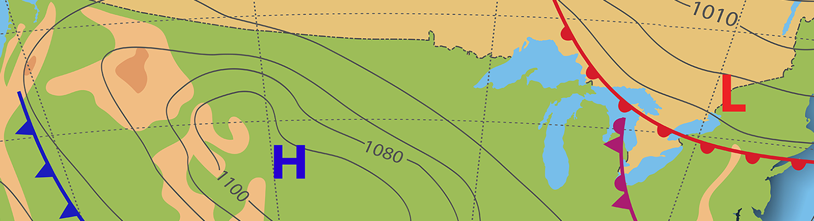

## Purpose: To assist you in your understanding of the assignment topics
The following videos were developed by your instructor to assist in your understanding of the Assignment Topics. If you view a video, I would appreciate some type of feedback to include any corrections, comments, complaints. Your feedback will let me know this type of additional support is appreciated and will encourage me to provide additional assistance on future assignments.
Note: this material is not to be shared. This is bonus support provided by your instructor and not intended for students in other bootcamps.

* Module 2: VBA of Wall Street 
  - Video 1 - Inital Analysis (https://zoom.us/rec/share/LpOqSATLNamBQ4MBCmUWnGcts3lezZClHUIMSZN0GYWBn_CrGJg9Fe8kJylX7pyn.yiIMi4ChwB6s-w57?startTime=1637335741000)
  - Video 2 - Refactoring Analysis (https://zoom.us/rec/share/GCqs10QONVaing6uzSyJ5YXyQEJ8WKVKjlWOqLoRWd_ERW2C2buTeJA8aPwZoPsB.MhSWqG5LCrQrmyK4?startTime=1637415343000)

 

* Module 3: PyPoll with Python (https://zoom.us/rec/play/NgqSdBoLLRs-J-X_bDsJ3z8hp7nnZSRnMHnydAwDfEA26-uBzA4ijxX8Qo0m8-Acoz4QEA7Y7TyV1_Ze.TDxvnbUcra0DXwT3?startTime=1636569115000)

 

* Module 4: PyCitySchools with Pandas (https://zoom.us/rec/play/U2aP18AdenFJUq_SH7vaIiONkNzF0lTX_D1OFcMyKfmuRvNY7nfcmLFFHkuOQzH3l-29p_uJS0EYHLgs.o-WaXmtNrAWRci-r?startTime=1637429499000)

 

* Module 5: PyBer with Matplotlib (https://zoom.us/rec/play/1JkpWoH9UUx9ZHIy1Zczu50pi_jp5xQruDEF-ec88biNvRxzqRPZ7MnCNaZpP0-WdEyx9lqFve4nrenT.VK05ZxqSYPvBCFCW?autoplay=true&startTime=1637639050000) 
  
 

* Module 6: WeatherPy with Python APIs 
   
   - Deliverable 1 Video: (https://zoom.us/rec/play/r_PyWOVKHFzukmGTbpKRnBPeZtRBJ_F9P6LutdKwQzquPkoJiIZDbRlK2z1oirh7AkcKXAdk6XhGwvKI.9W-KcjRfn9Epd8hM?autoplay=true&startTime=1638467138000)
   - Deliverable 2 & 3 Video: (https://zoom.us/rec/share/zNhyCkba28cYb5CYaBiykgl_AuxS9kiVvxidMGOvO3rFMykowEyiZTP5fZ_Ch8nU.U7rgI2XUg5ATV3UY?startTime=1638536782000)

 

* Module 7: Employee Database with SQL 
  - Deliverable 1 Video (https://zoom.us/rec/play/eHoX1KlfbjdTfc5-fUYRbU-IlHnBa8UKmgJknRSzTiQnQnv_06FG3Kw5WuYND-5-kesZtvctcF_ICH-j.lHlDTkANOUJ7uu2o?autoplay=true&startTime=1638549459000)
  - Deliverable 2 Video (https://zoom.us/rec/play/zhdEpkHLxhaWb_zXTWgL19CvTylPCBVhdR5FGDnjVkVxpa2BPQjUk1Hjbxj_p4HL7mLlZtGQw3lLNp-K.SsEYKaIw0slq1pjz?autoplay=true&startTime=1638556651000)

 

* Module 8: ETL - Extract, Transform, Load (https://zoom.us/rec/play/BmlPsofX-fOZH-vYQzVtt6U3xAH0ndY8Rs3oU-aPc3PwOgYtCCX0QCJN713IX3uNGUfLFNqEYXUAoms1.tHkBrJnUjz1WLJgW?autoplay=true&startTime=1639148157000)
  - Deliverable 1: starts at the beginning and ends at the 30:00 min mark
  - Deliverable 2: starts at  30 min mark and ends at the  1:39:40 mark
  - Deliverable 3: starts at 1:39:40 mark and ends at the 2:16:08 mark
  - Deliverable 4: starts at 2:16:08 mark and ends at the 2:47:43 mark
  - Methodology: [ETL Methodology Available in Methodology folder](./Methodology/ETL_Methodology.pptx)

 

* Module 9: Surf's Up with Advanced Data Storage and Retrieval (https://zoom.us/rec/play/96z48qqqLl27IUsq1m11T2oMl7ePUsO1Ul7zP8xEZ1fDgOhvTcomi1DtKExZrfrk9cSDpp4uA6xun_ot.gLMcTNub2iZd24n2?autoplay=true&startTime=1639919012000)

 

* Module 10: Mission to Mars - Webscraping with HTML/CSS (https://zoom.us/rec/play/uN6hZ-DsNkaXrzeEiGwH1tvqohyebRvmqhCoxO-cu3P6wjR0iHJDld2vGCYauBpTiWg1a_mSNt-wdd2F.RuO31gc5NyGrjQ9W?startTime=1640350234000)

 

* Module 11: UFO Sighting with JavaScript 
  - Video 1: (https://zoom.us/rec/play/ceWfSKPZGAsSTYzrliDBPhYcUnNC-QK1PGztIwsWOcewt85xyJy_8a4a5ZF_tA743a2mlh7dkHAOBjxv.-qbMN3zNHkmUW4i_?autoplay=true&startTime=1641578899000) 
  - Video 2: (https://zoom.us/rec/play/hswv716-8bVF6QAsFeQxBwi5tejzJzScPbTg_zUuxju0BJ-U2_r4CO9xqMjmgmv4X1Ox8_69YwXB3EWU.lCScZeDv1Go7WzgF?autoplay=true&startTime=1641584722000)
  - Methodology: [UFO Methodology Available in Methodology folder](./Methodology/Methodology_UFO_Challenge.pptx)

 

* Module 12: Biodiversity with Plotly 
  - Deliverable 0 (https://zoom.us/rec/play/3Xr0D-T0X1fk11RcFhjzDeNzOuD9ftUJoQ4n58kCDqMetNBPWaexXvVkQiXFtBrAMhvVLZ84RJGSdkvd.0AMWmt3vX8k0AKFe?autoplay=true&startTime=1642103894000)
  - Deliverable 1 - Bar Chart(https://zoom.us/rec/play/tuo40yyLhTJ3TbefFQUNGC0OjKOjf6Jwt2VkXOgUmm7puhYf2ASjTQDUBhAORSpz7SkgVadaQ5PB1bKS.FL_xu5gQkrCU1Vi7?autoplay=true&startTime=1642106672000)
  - Deliverable 2 - Bubble Chart(https://zoom.us/rec/play/lAy5__4m-tHgyC0fnzBQhtHUgYQJTWxU559ugutt5E-ZRRFNWRzqhvO7QE7T7OUwcRr_W6jE1G26Gk4e.gNqTL6WTo2KTdTtz?autoplay=true&startTime=1642108698000)
  - Deliverable 3 - Gauge Chart (https://zoom.us/rec/play/wUB-tEG7mhHsyN79ilrsILkl_B7LcpbQceavRMGQG8nw1-jqnI5uJ0T_j19beDNmQF6RzipeoyHWoFYj.CaK4j6MjbZw10tej?autoplay=true&startTime=1642109841000)
  - Deliverable 4 - Customize Dashboard (https://zoom.us/rec/play/LV0W8on6KijnWS2BAfIr1tajAHdqO4nto_3A0Z0vKDYAEy8CnfUtzURvf-mDTUg191a2OcldCeKCAilH.JfzhtIyQMitigqDq?autoplay=true&startTime=1642112669000)
  - Methodology: [Biodiversity Methodology Available in Methodology folder](./Methodology/Methodology_biodiversity.pdf)

 

* Module 13: Mapping Earthquakes with Leaflet JS 
  
  - Video 0 - module work to create a working leaflet map of earthquake data(https://zoom.us/rec/play/v-8iH4q7wCEdwzimkFLQflCj5M5JS1xol4qCF-iCe_0gZMjLT0qbZ_Ahu_VVa5UGATz73H3OyQm484hq.RJ4jYbJGddTyzkrp?autoplay=true&startTime=1642861157000)
  - Video 1 - Deliverable 1 add tectonic plates (https://zoom.us/rec/play/SriiEwcN2dl7mi4uPvS-CNdajYCIknMz6nSm1F7e_Mibo1Pyl2lkcKbVnTYxBKodl4VGUd7qzr9EKDyF.Uk8r0NxoGi96hche?autoplay=true&startTime=1642869329000)
  - Video 2 - Deliverable 2 add Major Earthquake (https://zoom.us/rec/play/VRkEHBLcYm73ubZR0EkqOhNp9AdLTTzEsVT2AilZVrm4b0f0ZSirBtxStRFlmnc0mYCW4dlU-9_AJwU.1FYBAXXKtjqqxSiP?autoplay=true&startTime=1642870257000)

 

* Module 14: Citybike with Tableau (https://zoom.us/rec/play/XMokkQplcQm2cN_te_UZQ0BqUhSqIePGwmo0NaNLBV03Pw_ZRhVkVkgnktzr0ahgtlx4WGv0JuDKVzrQ.bLL2h9reeD8oaPcZ?autoplay=true&startTime=1645210751000)

 

* Module 15: MechaCar - Statistics and R (https://zoom.us/rec/play/-Y7bRLr62ZBxhg3n_aXRcMosQmZ72JlwYVz1DcXn4KaD8AZjx5A9mteO3r527fe0YpPawU1QiId-3bji.qmBhdRuVsWEISaXQ?autoplay=true&startTime=1644073959000)

 

* Module 16: Big Data with AWS 
  
  - Deliverable 0: Prior to taking the steps in Deliverable 1
    - you will need to create a AWS RDS (postgreSQL instance) and ensure that this database is publicly accessible (if you have questions on how to setup AWS RDS checkout this ETL video that reviews Day 2 Activity 04 ETL of employee information. You will need to load different data for Module 15 Challenge but the methodology is similar. (https://zoom.us/rec/play/cPsu9mlI_x2tydi6EBRV8pJyrlJFiKdvY6nRETnH5prPSxijAnn_G6hA3WaoBrx6Xb4x_oKt4zbNSs3a.dLm39NjHwU1YR9gx?autoplay=true&startTime=1644694519000)
  - Deliverable 1 (timestamp 0 - 41 minutes) I assume you already have created an AWS RDS (postgreSQL instance)(https://zoom.us/rec/play/cIsw8tpY8d9geJzveybBf7x7zxuE9UGnFB9hk5DGIZ-SXbrguTC9QOrsS1jf4mbBfk2iO8BmU00HP33e.mGOm2e2M26otDA20?autoplay=true&startTime=1644868709000)

  - Deliverable 2 & 3 (timestamp  41 minutes - end). You can choose if you want to do your analysis using Pandas (jupyter notebook) or using SQL (query using pgAdmin) or PySpark (google colab notebook).
  - AWS Clean-up - Shutting Down Your Instances. After completing this assignment make sure to shut down your postgreSQL instance and delete your S3 bucket as recommended in the instructions. If you have questions on shutting down an RDS or deleting an S3 bucket reference module 16.9.2 and 16.9.3 to ensure you do not incur any unexpected charges.

 

* Module 17: Supervised machine Learning with Sklearn 
  * Deliverable 0: Preprocessing the data using python, pandas, sklearn standard scaler (optional) 
    - Video 1: Steps to clean the data (using python and pandas)
  (https://zoom.us/rec/play/ekUlAHHakTOIKlf-qlk7XfdBFWASXymL3kmNm0VSTILQMLyWZ6M165TpHP1z9GVuAhmbFtLj6RIkT7RF.cnOXFP226qB0t4HF?autoplay=true&startTime=1645551146000)   
    - Video 2: additional pre-preprocessing steps to put the data into the correct format. This includes using get_dummies from pandas to ensure our data is all numeric and (Optional standard scaler -from sklearn) to account for the difference in the values used in each column. (Optional Establish a Baseline) I also use logistics regression (without changes in sampling) to establish a baseline to compare the work we will do later.
  (https://zoom.us/rec/play/R9_mV4ClZuCYYJvXM1fV5CzId24rpEZfJvkefRCBBfSuXZXtyQ9GscybSRzlDa4yOYuo4bq3y4NyktmV.ppje-E1tT1m4u6EF?autoplay=true&startTime=1645555968000) 
    

  - Deliverable 1: Use Resampling Models to Predict Credit Risk  
    - Video 3: This performs Resampling (both over and under). It performs oversampling using RandomOverSampler and SMOTE, and undersampling using ClusterCentroids. For get an accuracy score for each technique along with a confusion matrix and imbalanced classification report.
  (https://zoom.us/rec/play/s8AgBLfUZ0P8Iud8vFaEPS1v01zj54AO8dtwiUhXTHhOj_Tng7OvAlGjVm-qP4RqZ8oms5Zr1ohb_A6s.gxfnmYlf5eWG1o19?autoplay=true&startTime=1645558537000)   

  - Deliverable 2: Use the SMOTEENN algorithm to Predict Credit Risk
    - Video 4: I follow the steps in module 17.10.3 Combination Sampling with SMOTEEN to resample the data using SMOTEEN and get an accuracy score for each technique along with a confusion matrix and imbalanced classification report. Note: in this video I created the model and then used the wrong model to find the resampled data. My mistake was using SMOTE vs. SMOTEENN When I "# Train the Logistic Regression model using the resampled data this was in cell 62 of my notebook).  Follow module 17.10.3
  (https://zoom.us/rec/play/1o2P2EI8mW9ucjzNUxaikanhCGSacJ984uv3tZHGxWjLF96DTa0f4B6zjbW3TxwmYLN-LsZC151C2Gsg.JN4GFIhu8yFuMHFo?autoplay=true&startTime=1645562611000)   
  - Deliverable 3: Use Ensemble Classifiers to Predict Credit Risk  
    - Video 5: Use the credit_risk_ensemble_starter_code.ipynb notebook. This starter code requires us to perform the same data cleaning / preprocessing steps we used for deliverable 1 & 2.   These preprocessing steps are performed in video 5. This model also starts the use of the BalancedRandomForestClassifier from imbalanced-learn
  (https://zoom.us/rec/play/BU6Rya1azBlyvDkBFfSS9JoIUMSuK7vJhWs3zWvJOCRCeoK99tbmVisr9K-E-M9UHyQuSRdOV9WygcXv.zrwYLl6q1W6LVfI6?autoplay=true&startTime=1645571837000)   

    - Video 6:  I continue with my use of the BalancedRandomForestClassifier from imbalanced-learn and print the feature importance, sorted in descending order (from most to least important feature). I also use the EasyEnsembleClassifier ans assess its performance. The video ends with a review of the findings and updating my readme.md file
  (https://zoom.us/rec/play/IOijGqoQXgBzh55FblLnQPTtPQckcJIMeaqRuQABIK4t89RkMNv8ug-txEnKazoyt_8_IG4ns_s92PHO.F4zTYIpgOqHIltpy?autoplay=true&startTime=1645582331000)   

  - Deliverable 4: A Written Report on the Credit Prediction Analysis - you can then use the images you saved (confusion matrix) and a snap-shot of the imbalanced classification report to compare each technique's ability to categorize our target "loan_status" as either "high_risk" and "low_risk."

  - Methodology: [Credit Methodology Available in Methodology folder](./Methodology/Credit_Risk_Methodology.pptx)

 

* Module 18: Unsupervised Machine earning with Sklearn 
* **Video 1: Deliverable 1** - (~90 minutes) Data Cleaning and Pre-Preprocessing using pandas. In this video I follow (most of ) the pseudo code provided in the starter code to clean the crypto_data.csv file. It starts with a crypto_df with a shape of 1242 rows and 7 columns and data cleaning ends with a dataframe with 531 rows and only 4 columns.  I broke the starter notebook into two notebooks (one on data cleaning and covers video 1).
https://zoom.us/rec/play/KBzPt5stbL5ko2tDVqHWiXDB6HEfEgYtItOHOxGuP4b07OCUv5qxftMF5Oo5cml3LS_EtbwuC0Iq9E4.cUrcuvrAd19gBtDb?autoplay=true&startTime=1646060632000

* **Video 2: Deliverable 2, 3, 4** - (~ 90 minutes) Reducing Data Dimensions Using Sklearn's PCA, and Clustering using K-means and then I created a 3D-scatter plot with plotly.express and a 2D scatter plot of TotalCoinsMined vs TotalCoinsSupply using hvPlot. I also created an html table using hvPlot of all the currently trading (and mined) cryptocurrencies in the dataset provided. Note I made the methodology after going through the starter code. If I had to do it again I would have created the methodology slide first as this could have helped me keep better track of my progress in meeting each of the 4 deliverables.
https://zoom.us/rec/play/cRnjRYbG0lM-ZxLvjPvCsx9R8H862ntwq83Z-9Il6Xe1bFsQhng_WVG4itZqxtsAFWbQzMIz_DRmFB5n.lVi9dl0XbONXXpBH?autoplay=true&startTime=1646067875000

 

* Module 19: Neural Networks and Deep Learning with TensorFlow 
* **Video 1 - Deliverable 1: Preprocessing Data for a Neural Network Model.** This takes in the charity_data.csv and creates a DataFrame and performs some feature selection and data cleaning. OneHotEncoder is used to transform categorical values into numeric values and the resulting df is merged with the original DataFrame. The data is split into the Feature Matrix (X) and y and the data in the feature matrix (X) is scaled using StandardScaler.
https://zoom.us/rec/play/xm1ZK6DBRFft2U1ZzRH0uzldjB4CA6iyxbpiLDIwHGulCiNZNCefHoJlvGiTVJSEZtgkZUBYWBtshMzU.J3jXMmQzK9_ciysG?autoplay=true&startTime=1646407059000

* **Video 2 - Deliverable 2: Compile, Train, and Evaluate the Neural Network Model.** This continues with the work done in Video 1 and defines a model, compiles and trains a model, evaluates the model and saves the model.
https://zoom.us/rec/play/di5DEVwwVzaDkmVIeZz5l-vF3V9dBP-ZV1j6VmqtLKrYRxiPity_UVuVRgNY3c2KJcMI_SvRnHEyQ0se.L5Pz6hOgX_49i1Ks?autoplay=true&startTime=1646413742000

* **Video 3 - Deliverable 3: Optimize the Model.** This video includes three separate models in an effort to reach a predictive accuracy higher than 75% using the following techniques: dropping more or fewer columns, creating more bins for rare occurrences in columns, increasing or decreasing the number of values for each bin.  Other techniques include modifying the Neural Network Module by adding more neurons to a hidden layer, adding more hidden layers, using different activation functions for the hidden layers or adding or reducing the number of epochs to the training regimen. I ran an additional RandomForestClassifier model for comparison and to identify which features it identified as most important.
https://zoom.us/rec/play/HnuXFAYZRdHtitgzS7zBweKld3zsO_8g5xSGxbUE_uistPfmnAyv9RkFfoWjXeKmfBOvzwl7SP-JXBy1.WcgqHYTtgaSOKPxB?autoplay=true&startTime=1646442510000

  - Methodology: A Methodology is available in the Methodology folder under "Methodology_Neural-Networks.pptx"